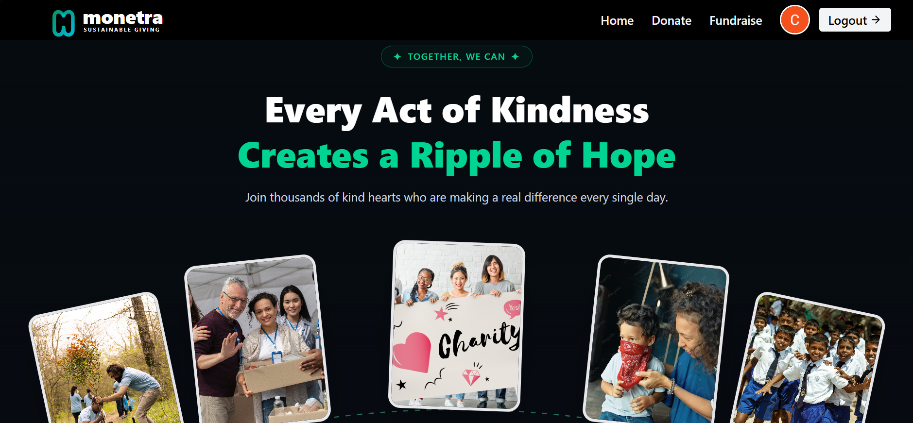

# 💸 Monetra — Full-Stack Crowdfunding Platform

**Monetra** is a modern full-stack crowdfunding platform that enables individuals and organizations to create fundraising campaigns, securely receive donations, and track campaign progress in real time. Built with **Next.js**, **MongoDB**, **NextAuth**, **Tailwind CSS**, **Cloudinary**, and **Razorpay**, Monetra delivers a seamless experience for both campaign creators and donors.

The project showcases production-ready architecture with secure authentication, payment processing, cloud image storage, responsive UI, RESTful APIs, and an interactive dashboard.

---

## 🌐 Live Demo

> **Live:** https://monetra-rho.vercel.app/

---

## ✨ Features

### 🔐 Authentication & Authorization

* Secure authentication using **GitHub OAuth** and **Google OAuth**
* Session management with **NextAuth**
* Automatic user registration on first login
* Protected routes
* Persistent login sessions
* Secure logout functionality

---

### 🏠 Modern Landing Page

* Premium responsive hero section
* Circular image arc inspired by leading crowdfunding platforms
* Beautiful call-to-action cards
* Animated UI
* Mobile-first responsive design

---

### 🎯 Fundraiser Management

* Create fundraising campaigns
* Edit existing campaigns
* Delete campaigns
* View campaign details
* Upload fundraiser cover images
* Campaign categories
* Goal amount tracking
* Rich campaign descriptions
* Campaign status management

---

### ❤️ Donation System

* Browse all active fundraisers
* Search campaigns instantly
* Filter campaigns by category
* Donate securely through **Razorpay**
* Anonymous donation support
* Automatic payment verification
* Donation history
* Transaction storage
* Real-time campaign progress updates

---

### 📊 User Dashboard

Every authenticated user has access to a personalized dashboard featuring:

* Profile information
* Profile picture
* Cover image
* Bio
* Created fundraisers
* Donation history
* Total amount raised
* Total amount donated
* Campaign analytics
* Account settings

---

### ☁️ Cloudinary Integration

* Campaign cover image upload
* Profile picture upload
* Optimized cloud image delivery
* Secure image management

---

### 💳 Razorpay Integration

* Secure payment gateway
* Payment success handling
* Payment failure handling
* Signature verification
* Transaction recording
* Automatic fundraiser progress updates

---

### 👨‍💼 Admin Features

* Admin dashboard
* Report campaign management
* Fraudulent campaign removal
* Campaign moderation
* User management

---

### 🎨 UI & UX

* Fully responsive design
* Dark mode support
* Beautiful loading skeletons
* Smooth animations
* Interactive cards
* Progress bars
* Bookmark fundraisers
* Share campaigns
* Recent donation feed
* Leaderboards

---

## 🛠 Tech Stack

### Frontend

* Next.js (App Router)
* React
* Tailwind CSS

### Backend

* Next.js API Routes
* Node.js

### Database

* MongoDB Atlas
* Mongoose

### Authentication

* NextAuth.js
* GitHub OAuth
* Google OAuth

### Payments

* Razorpay

### Cloud Storage

* Cloudinary

### Deployment

* Vercel

---

## 📂 Project Structure

```text
src
│
├── app
│   ├── api
│   │   ├── auth
│   │   ├── donate
│   │   ├── fundraisers
│   │   └── profile
│   │
│   ├── donate
│   ├── fundraise
│   ├── fundraiser
│   │   └── [id]
│   ├── login
│   ├── profile
│   └── page.js
│
├── components
│
├── lib
│
├── models
│   ├── User
│   ├── Fundraiser
│   └── Donation
│
├── utils
│
└── public
```

---

## 🗄 Database Architecture

```text
User
 │
 ├──────────── creates ────────────┐
 │                                 │
 ▼                                 │
Fundraiser                         │
 │                                 │
 ├──────── receives ───────────────┤
 │                                 │
 ▼                                 │
Donation ───────────── made by ────┘
```

---

## 🚀 Application Workflow

```text
User Visits Website
          │
          ▼
Login with GitHub / Google
          │
          ▼
User Account Created
          │
          ▼
Create Fundraiser
          │
          ▼
Campaign Published
          │
          ▼
Campaign Appears on Donate Page
          │
          ▼
Another User Donates
          │
          ▼
Razorpay Payment
          │
          ▼
Payment Verification
          │
          ▼
Donation Stored
          │
          ▼
Fundraiser Updated
          │
          ▼
Dashboard Updated
          │
          ▼
Real-Time Progress Updated
```

---

## 📡 REST API

### Authentication

| Method     | Endpoint                  |
| ---------- | ------------------------- |
| GET / POST | `/api/auth/[...nextauth]` |

### Fundraisers

| Method | Endpoint               |
| ------ | ---------------------- |
| GET    | `/api/fundraisers`     |
| POST   | `/api/fundraisers`     |
| PUT    | `/api/fundraisers/:id` |
| DELETE | `/api/fundraisers/:id` |

### Donations

| Method | Endpoint         |
| ------ | ---------------- |
| POST   | `/api/donate`    |
| GET    | `/api/donations` |

### Profile

| Method | Endpoint       |
| ------ | -------------- |
| GET    | `/api/profile` |
| PUT    | `/api/profile` |

---

## ⚙️ Installation

### Clone Repository

```bash
git clone https://github.com/your-username/monetra.git
cd monetra
```

### Install Dependencies

```bash
npm install
```

### Configure Environment Variables

Create a `.env.local` file:

```env
NEXTAUTH_URL=http://localhost:3000
NEXTAUTH_SECRET=your_nextauth_secret

MONGODB_URI=your_mongodb_connection_string

GITHUB_ID=your_github_client_id
GITHUB_SECRET=your_github_client_secret

GOOGLE_CLIENT_ID=your_google_client_id
GOOGLE_CLIENT_SECRET=your_google_client_secret

RAZORPAY_KEY_ID=your_razorpay_key

RAZORPAY_KEY_SECRET=your_razorpay_secret

CLOUDINARY_CLOUD_NAME=your_cloud_name
CLOUDINARY_API_KEY=your_api_key
CLOUDINARY_API_SECRET=your_api_secret
```

### Run Development Server

```bash
npm run dev
```

Visit:

```text
https://locahost:3000
```

---

## 📸 Screenshots

* Home Page
* Donate Page
* Fundraiser Details
* Fundraise Page
* User Dashboard
* Payment Flow
* Profile Page



---

## 🎯 Key Highlights

* Full-stack architecture using Next.js App Router
* OAuth authentication with GitHub and Google
* Secure payment processing with Razorpay
* Cloud-based image management with Cloudinary
* MongoDB relational schema using Mongoose
* RESTful API design
* Protected routes and session management
* Responsive and accessible UI
* Real-time fundraiser progress tracking
* Production deployment on Vercel

---

## 📈 Future Scope

* AI-powered fundraiser recommendations
* Email notifications
* Social sharing integration
* Campaign updates and announcements
* Multi-language support
* Advanced analytics dashboard
* Recurring donations
* Organization and team fundraising

---

## 🤝 Contributing

Contributions are welcome! Feel free to fork the repository, open issues, or submit pull requests to improve Monetra.

---

## 📄 License

This project is licensed under the **MIT License**.

---

## ⭐ Show Your Support

If you found this project helpful or inspiring, please consider giving it a **⭐ Star** on GitHub. It helps the project reach more developers and supports future improvements.

---

<div align="center">

### Built with ❤️ using Next.js, MongoDB, NextAuth, Tailwind CSS, Razorpay & Cloudinary

**Empowering Ideas Through Community Funding.**

</div>
